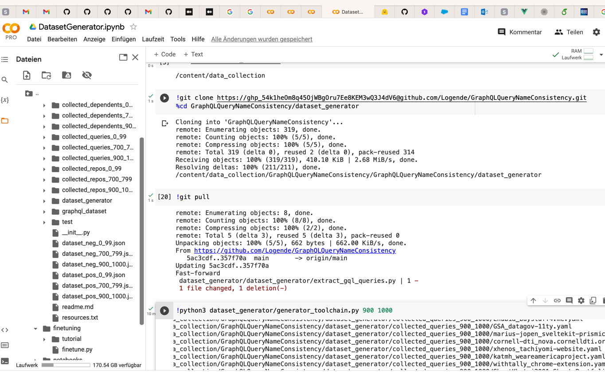
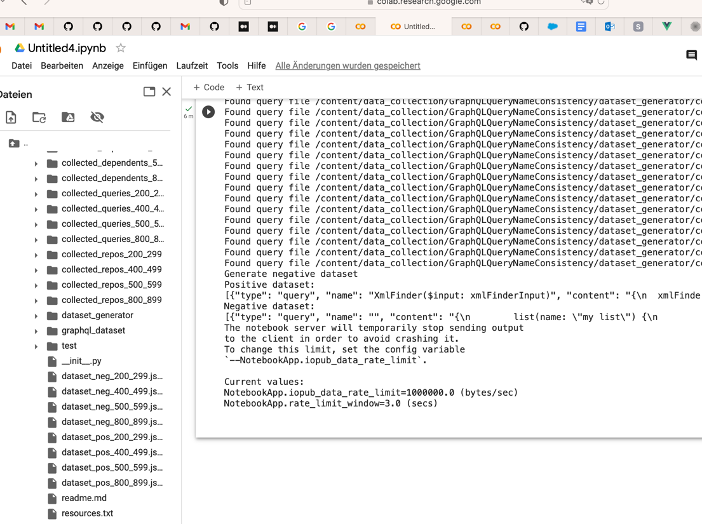
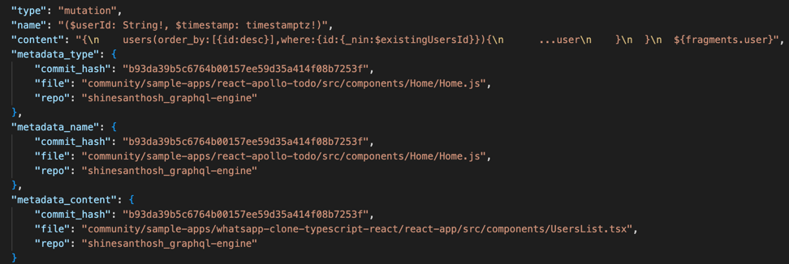
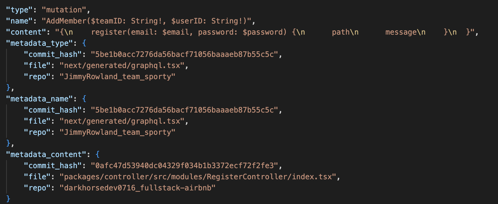

# Building dataset
This section describes the dataset generation toolchain.

**Usage in short (see below for more explanation):**

As the list of dependent repositories is checked into this repo, it is not needed to generate it again.
If you want to generate it anyway, then

Execute `python3 dataset_generator/find_dependent_repositories.py`

This will generate a CSV file containing a list of 1000 repos that use the Apollo Client.

Execute `python3 dataset_generator/generator_toolchain.py <repo_range_start> <repo_range_end>`

This will clone the repos from the CSV within the provided range (max possible range is 1 to 1000),
extract GraphQl queries from those repos and put them together into a positive dataset.
Next, it will generate a negative dataset by randomly mixing the positive query-name pairs up.

Note that the generator_toolchain can be called multiple times in parallel (e.g. first with range 1 to 99, then 100 to 199, etc.).




See `dataset_generator/QuickDatasetGenerator.ipynb` for an example of how to generate a dataset subset.

Finally, execute `python3 dataset_generator/combine_and_split_datasets.py` to merge all dataset subsets and then split them into train, validation and test. 


## Find suitable repos

Decision: focus on JavaScript/Typescript projects. 
Collect list of projects that use the [Apollo Client library](https://github.com/apollographql/apollo-client).

Dependent repositories are shown by Github [here](https://github.com/apollographql/apollo-client/network/dependents).

Use the [github-dependents-info](https://github.com/nvuillam/github-dependents-info) code to generate a list of the dependents.

Problem: Apollo Client has more than 195.000 dependent repositories. 
Scraping the website for all dependents would require accessing more than 6500 Github pages programmatically (as each page lists 30 dependent repositories).
After around 25 page accesses, we experienced a timeout that takes many seconds, until scraping can continue.
As for the project we stick to 1000 repositories for dataset generation, the repo scraper was modified to stop once it collected 1000 repos.
Additionally, the scraper was modified to collect the repositories of the `@apollo-client` and `apollo-client` only and ignore the other packages (`apollo-boost`, `apollo-cache`, ...).
We make use of the `min_stars` parameter of the script and collect repositories with at least 3 stars only.

Execute `python3 dataset_generator/find_dependent_repositories.py`

The resulting CSV of identified repositories is stored in `collected_dependents/dependents_apollo-client.csv`.

## Clone repositories

Execute
`python3 dataset_generator/clone_dependent_repos.py`

This will clone all the dependent repositories (listed in `collected_dependents/dependents_apollo-client.csv`) into a `collected_repos` folder.

Problem: attempting to clone the repo `liferay/liferay-portal` lead to a `file too large` error. 
This was solved by manually removing this repo from the list of collected dependents.

Problem 2: sometimes the cloning process will fail. 
This was solved by putting an endless loop and a try-catch-block around the cloning process.
Whenever the process fails, it will just start all the cloning again, but skip repos that were already successfully cloned before.

Problem 3: sometimes a repository does no longer exist. 
This was solved by explicitly catching this scenario and then creating an empty repository folder, so the endless cloning loop will not attempt to clone it again.


## Extract GraphQL queries (and mutations)

### Step 1

Execute
`python3 dataset_generator/extract_gql_queries.py`

This will iterate over all repos and over all files within those repos.
All JavaScript and TypeScript files will be read.
It will be attempted to extract GQL operations from those files.

This is done by looking for the regex pattern gql\`<operation>\`.

It will be checked whether `<operation>` actually is an operation or whether it is a fragment or something else.
If neither operation nor fragment can be extracted in a trivial way, it will be checked whether the `<operation>` value is a placeholder expression of the form `${<variable_name>}'.
Should this be the case, the extraction algorithm will be applied on the value behind this placeholder.
This can be done by previously extracting all constant variables from all Javascript and Typescript files using regular expressions.

If it is an operation, it will be attempted to extract the operation type (`query`, `mutation` or `subscription`).
Next, it will be checked whether there exists a custom operation name (e.g. query name). This will be extracted too.
The rest of the operation will be stored as operation content.

Extracted fragments and operations will be persisted in a YAML file inside the `colleced_queries` folder, one file for each repository.

Pda
Example of this issue:

````
    regex = r"gql`(\s|((?!`).)*)+`"
    matches = re.finditer(regex, data, re.MULTILINE)
    
    for _, match in enumerate(matches, start=1):
        print("This loop will take forever or at least very long")
````

on the data
````
// create a component to use the apollo library react hooks to feth the pair data from the subgraph
// import {useQuery} from '@apollo/react-hooks';
// import {gql} from '@apollo/client';
// import {BigNumber} from 'ethers';
//
// const UBE_SUBGRAPH = "https://api.thegraph.com/subgraphs/name/ubeswap/ubeswap"
//
// const PAIR_QUERY = gql`
//     query GetPair($pair: String!){
//         pair(id: $pair) {
//             id
//             name
//             symbol
//             decimals
//             derivedCUSD
//             tradeVolumeUSD
//             totalLiquidity
//             txCount
````

### Step 2

Execute
`python3 dataset_generator/combine_extracted_queries.py`

This will read all the extracted operations and fragments from Step 1 and combine them into one singular `collected_datasets/dataset_pos.json` file.
In this step, only operations are considered and fragments are ignored.
JSON format is used for increased performance in comparison to YAML.

## Generate negative dataset

Execute
`python3 dataset_generator/generate_negative_dataset.py`

This will randomly mix up name-query pairs of the positive dataset and put the results into a new file `collected_datasets/dataset_neg_json`.
The length of the negative dataset will be the same as the length of the positive dataset.

### Difficulty extension

As the fine-tuned model reached extremely high classification accuracy, an option was added to make the negative dataset more difficult.
Besides the method of completely randomly mixing up query name and query content, a second method for generating sampling was added.
This method also pairs a query name (and operation type) with the content of another random query. 
However, it, additionally, makes sure that both queries originate from the same repository. 
Queries from the same repository often manipulate or access similar data and share a lot of context and similarity.

A parameter `percentage_difficult` can be provided in the code, that decides what percentage of the generated negative dataset samples should use this new generation method.

Examples of the resulting more difficult negative samples:


Negative sample with similar words in query name and in content


Negative sample with similar semantics in query name and in content

## Splitting into train, validation and test

Finally, execute 
`python3 dataset_generator/combine_and_split_datasets.py`

This will load all generated datasets from the `collected_datasets` folder. It will differentiate between positive and negative datasets.
The positive (or negative) datasets are then merged and then split into 80% training dataset, 10% validation dataset and 10% test dataset.
The results are persisted under the folder `final_datasets`.

## Limitations

TODO: too simple