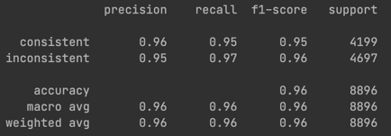
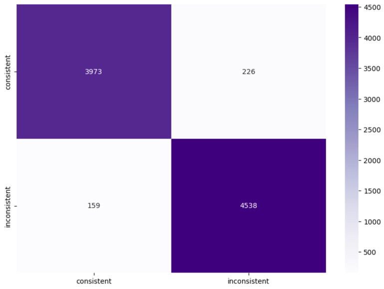
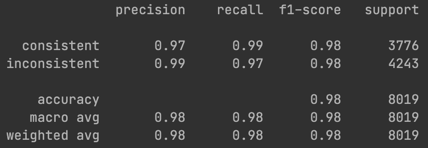
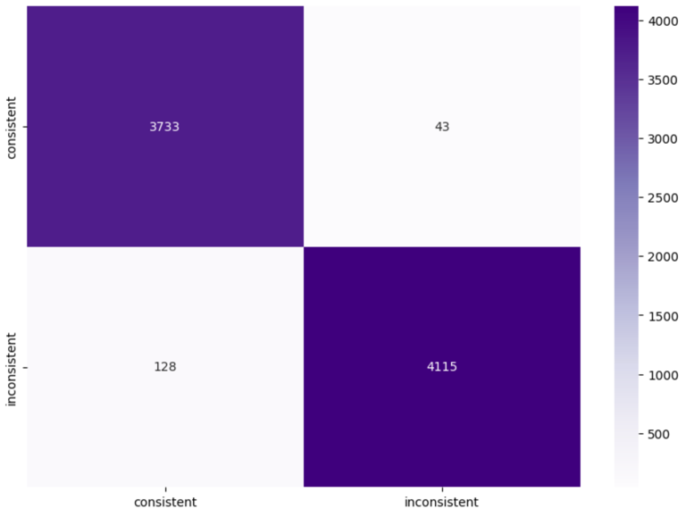

# Finetuning

This folder deals with fine-tuning (Code-)T5 with the data generated in the data_generator step.

`finetune_with_baset5.py` was built upon the code in `example_imdb`.
The biggest change from the imdb code was dataset loading (combined dataset files instead of each data point in a separate file) and the input provided to the tokenizer.
For the graphQL use case, the input that is encoded is the query code, then a separator and then the query name.

`finetune_with_codet5` builds upon that but uses CodeT5 instead of base-t5 and replaces T5Tokenizer with RobertaTokenizer.
There currently is some issue with it (see `notebooks/finetuning_codet5_with_graphql_issue.ipynb`).

Finally, in the `cmi_finder` folder is adapted code from the paper https://software-lab.org/publications/icse2023_CMI-Finder.pdf, where
CodeT5 and RobertaTokenizer are being used for fine-tuning for a binary classification task.
I've attempted to get their code running but have not succeeded with it so far.

As GraphQl queries are not very close to general purpose programming languages, it seems to be good enough to stick with base-t5.

# Evaluation

The fine-tuned base-t5 model was evaluated using the test dataset.

In the initially used dataset, most of the negative samples differed considerably from the positive samples, leading to very high accuracy.

After discovering that the samples still contained entries with an empty query name, I cleaned up the dataset by removing those samples with empty query names.
I repeated the training process, as well as the evaluation (on the new test dataset) and got even higher accuracy (as before it was random and not learnable for the model whether a pair is consistent or not when the query name is empty).

As the accuracy was so high, I decided to introduce more difficult negative samples to make it more challenging for the model.
Trained with the simple dataset, but tested on the more difficult dataset, we get the following results:

